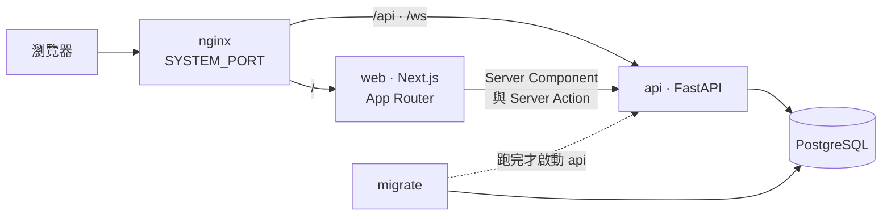

# Project Starter

FastAPI + Next.js 全端 monorepo 起始模板。內部自用，權利保留（未授權公開散布）——
授權以這一句為準，repo 裡**沒有** `LICENSE` 檔，不必去找。

**要從這份模板開新專案 → [`TEMPLATE.md`](TEMPLATE.md)**（開案、剝除範例模組、改寫授權；
那份是一次性的，導入完成後就刪掉）。

## Quickstart

需要 Docker Desktop、`make`、`openssl`、`uv` 與 Node（版本以 [`apps/web/.nvmrc`](apps/web/.nvmrc) 為準）。

在 GitHub 上按 **"Use this template"** 開一個新 repo（拿到的是一份快照，沒有共同歷史，
之後也不會有同步 —— 理由見 [`TEMPLATE.md`](TEMPLATE.md) 第 0 節），然後：

```bash
git clone <你開出來的 repo> my-project && cd my-project
make init   # 互動式產生 .env，不需要網路
make setup  # 安裝主機端 lint／測試／型別產生工具
make dev    # 啟動開發環境（首次建置 image 約 2–5 分鐘）
```

打開 `http://localhost:<SYSTEM_PORT>`（預設 http://localhost:3000）。系統還沒有超級管理者時
會自動落在 `/signup`，填 `make init` 印出的 `REGISTER_KEY` 建立第一個帳號。

**這只是最短路徑。** 剝除範例模組、決定視覺、開分支保護、決定 CD、改寫授權 ——
完整的開案流程見 [`TEMPLATE.md`](TEMPLATE.md)，那份是這個主題的 owner。
起不來的時候看 [`docs/development.md`](docs/development.md#起不來的時候)。

## 這份模板包含什麼

**核心** —— 每個專案都會用到

一次性初始化（未初始化時進站直接進註冊畫面，以 `REGISTER_KEY` 建立第一個超級管理者）、
JWT 認證與角色型權限系統、超級管理者介面（使用者與角色管理）、游標分頁與篩選、
統一的錯誤與通知處理、**前後端一致的中英雙語**（可在設定頁切換，後端訊息跟著走）、
PostgreSQL、Docker Compose 開發／生產環境分離、版本化的資料庫 migration。

**機制** —— 已接好但沒有業務在用，要用時直接呼叫

WebSocket 即時事件推送（型別由後端 enum 產生，前端窮盡處理）、PWA 推播通知
（Web Push / VAPID，支援桌面瀏覽器與 iOS/Android 主畫面 App）、三層設計 token（換一套色票
只要改對照表，UI kit 一行不用動）與系統設定頁面。
這兩項已由 module registry 啟用，端點與連線都在跑，從 `modules.realtime.public` 或
`modules.push.public` 呼叫公開介面即可。

**範例模組** —— 示範用，可整包刪除

`items`「項目」是一個最小但完整的 CRUD 模組，示範新增一個功能要碰哪些檔案：
資料表 model（含關聯載入補建立者暱稱）、游標分頁、篩選、權限、WebSocket 通知、
列表頁 UI 與對話框。它刻意不代表任何真實業務，刪除步驟見
[`docs/architecture.md`](docs/architecture.md#移除-module)。

## 技術棧

| 層級 | 技術 |
|---|---|
| 後端 | FastAPI, SQLAlchemy 2.0 (async) + asyncpg, Python 3.14 |
| 前端 | Next.js 16 (App Router), React 19 (React Compiler), TypeScript 5, CSS Modules, Vitest 4, Node 24 LTS |
| 資料庫 | PostgreSQL 17 |
| 容器 | Docker, Docker Compose |

## 請求怎麼走



瀏覽器只認得 nginx 一個入口；前端在伺服器端打後端，瀏覽器不直接碰 api。
限流依賴 nginx 覆寫 `X-Real-IP`，每個 location 都要覆寫（`make check-nginx` 在守）。

## 文件地圖

| 你要做什麼 | 看哪裡 |
|---|---|
| **從這份模板開新專案**（一次性，做完就刪） | [`TEMPLATE.md`](TEMPLATE.md) |
| 用這個模板開出新專案之後要做的一次性決定 | [`docs/downstream.md`](docs/downstream.md) |
| 用 AI agent 開發：硬規則與容易安靜出錯的地方 | [`AGENTS.md`](AGENTS.md) |
| 本機開發、`.env` 設定、指令、提交規範、測試與 CI | [`docs/development.md`](docs/development.md) |
| 新增頁面／API 模組／權限／WS 事件／migration、加一個語系 | [`docs/extending.md`](docs/extending.md) |
| 依賴邊界、模組介面、目錄結構、新增或移除模組 | [`docs/architecture.md`](docs/architecture.md) |
| 設計 token 的分層、主題、導入外部 Design System、樣式層的檢查器 | [`docs/design-system.md`](docs/design-system.md) |
| 生產部署、帳號初始化、Session 撤銷、限流、備份 | [`docs/operations.md`](docs/operations.md) |
| 前後端型別契約怎麼產生與消費 | [`contracts/README.md`](contracts/README.md) |
| 回報漏洞、這個 repo 附帶哪些安全機制 | [`.github/SECURITY.md`](.github/SECURITY.md) |
| 變更紀錄 | [`CHANGELOG.md`](CHANGELOG.md) |

固定依賴方向是 `app → modules → shared`，跨模組只准使用 public entry，
由 `npm run check:architecture` 與 `tests/test_architecture.py` 靜態檢查。
